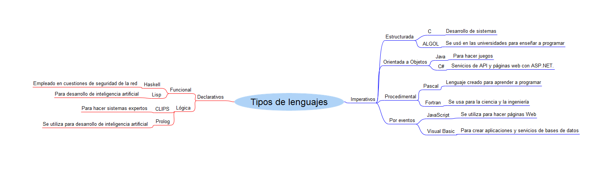

# Sistemas Experto
---
## Indice
- [Sistemas Experto](#sistemas-experto)
  - [Indice](#indice)
  - [Lenguajes imperativos y Declarativos](#lenguajes-imperativos-y-declarativos)
    - [Lenguajes Imperativos](#lenguajes-imperativos)
    - [Lenguajes Declarativos](#lenguajes-declarativos)
  - [Mapa Mental](#mapa-mental)
  - [Sistemas expertos](#sistemas-expertos)
  - [Que es CLIPS](#que-es-clips)
  - [Ejemplo de código CLIPS](#ejemplo-de-código-clips)

## Lenguajes imperativos y Declarativos
### Lenguajes Imperativos
Los lenguajes imperativos son lenguajes de programación que siguen o aplican el paradigma de programación **Imperativo** en el que hay que especificar paso a paso las funciones que se tienen que realizar y en que secuencia se tienen que ejecutar esos pasos para llevar a acbo una funcionalidad.

Estos tipos de leguajes cuentan con estructuras de control como bucles para tener un major control del flujo de ejecución del código fuente de la aplicación.

Algunos ejemplos de leguajes de programación imperativos son:
  - Java
  - JavaScript
  - C
  - PASCAL
  - Ensamblador

Dentro de los lenguajes de programación imperativos hay diferentes paradigmas de programación:

1. Programación estructurada
   1. Este tipo de programación se caracteriza por recurrir unicamente al uso de estructuras de control básicas para controlar el flujo de ejecución del programa por ejemplo: bucles, condicionales y estructuras de secuencia. 
2. Programaicón modular 
   1. Este tipo de programación se caracteriza por dividir programas en modulos o subprogramas con el fin de hacerlos mas legibles y manejables. Es una evolución de la programación estructurada para lidiar con programas muchos mas grandes.
3. Programación procedimental
   1. Este tipo de programación se caracteriza por utilizar funciones para realizar las operaciones y encapsular todo el código posible en funciones para poder reiutilizarlo.
4. Programación Orientada a Objetos
   1. Este tipo de programación se caracteriza por organizar el código en *Objetos* en lugar de funciones o lógica. Un Objeto es una instancia de una clase que se podría entender como utilizar plantillas para crear código, cada objeto tiene atrivutos y funcionalidades unicas.
5. Programación Reactiva o por eventos
   1. Este tipo de programación se caracteriza por **reaccionar** a eventos que se disparan en momento de ejecución. Por ejemplo FrameWorks de JavaScript como VUE tiene variables reactivas que se actualizan y modifican la interfaz cada vez que su valor interno cambia.

### Lenguajes Declarativos
Los lenguajes de programación declarativos son lenguajes que se basan mas en las matematicas y en la lógica, a diferencia de los lenguajes imperativos. Estos lenguajes son mas cercanos al *razonamiento humano* y no se define el **como se hace algo** si no el **que cosa hacer**.

Estos lenguajes de caracterizan por no tener efectos colaterales en la ejecución, esto se traduce a que siempre si se utilizan los mismos datos dará el mismo resultado y que una llamada no interfiere con otra, son procesos aislados.

Algunos ejemplos de leguajes de programación declarativos
1. Haskell
2. Prolog
3. Lisp
4. CLIPS
5. Miranda

Dentro de los lenguajes declarativos hay diferentes paradigams de programación:

1. Programación Funcional
   1. Este tipo de estructura de programación se basa en el uso de funciones mátematicas o funciones ya implementadas en el propio lenguaje para resolver problemas, esto se consigue encandendo llamadas a diferentes funciones para escribir un código *matemáticamente elegante*
2. Programación Logica
   1. Este tipo de estructura de programación se basa en la lógica matemática. Esto se lleva a cabo utilizando lógica de predicados, recursión, interferancia lógica, etc...

---

## Mapa Mental

---

## Sistemas expertos

Un sistema experto es un programa que utiliza hechos y reglas para tomar decisiones o resolver problemas en un tema en especifico. Estos programas estan hechos para simular el razonamiento human en capos concretos.

Los sistemas expertos se pueden utilizar en muchos ambitos diferentes, diagnosticos médicos, servicios técnicos, diseño de sistemas, etc...

Un ejemplo de sistema experto es en el ambito de la medicina para asegurarnos de que un paciente ha tenido algún sintoma o la medida de los datos es absolutamente correcta.

---

## Que es CLIPS

CLIPS es un lenguaje de programación declarativo especialmente diseñado para hacer sistemas expertos. Su nombre CLIPS viene de *C Language Integrated Production System* y fue desarrollado por la NASA en 1980.

CLIPS se basa en reglas, hechos y acciones para realizar sus funciones, esta son las principales caracteristicas de CLIPS:
1. **Reglas**: Se definen unas reglas que sirven para representar el conocimiento en el ambito concreto, cada regla tiene una condicion y una acción.
2. **Hechos**: Se definen hechos para representar la información de la que disponemos para hacer la ejección.
3. **Motor de inferencia**: CLIPS utiliza una motor de inferencia para utilizar las reglas y los hechos para llegar a conclusiones.
4. **Sistema de gestion de hechos**: Se encarga de administrar los hechos y proporcionar la base de conocimiento para la ejecución.
5. **Interfaz de usuario**: CLIPS proporciona una interfaz de usuario con la que interactuar con el sistema experto.
6. **Capacidad de extensión**: Al estar escrito en C se pueden añadir nuevas funcionalidad o librerias que este escritas en C

---

## Ejemplo de código CLIPS

El ejemplo del código de CLIPS esta en el archivo animales.clp en el directorio raiz